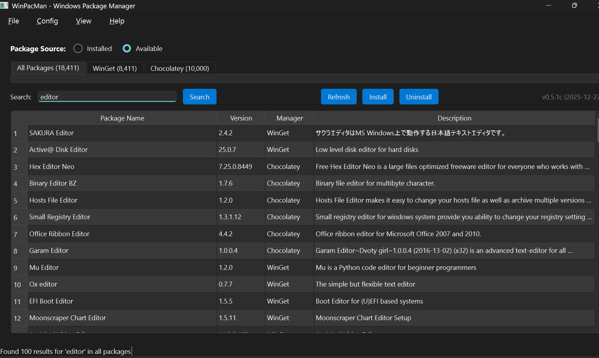

# WinPacMan - Windows Package Manager

A modern Python PyQt6-based Windows package manager that provides a unified interface for multiple package managers.

## Features

- Unified interface for multiple Windows package managers (WinGet, Chocolatey, Pip, NPM)
- Modern GUI interface 
- Modular architecture for easy extensibility
- XDG-compliant configuration management
- Threading for non-blocking operations



## Supported Package Managers

- WinGet
- Chocolatey  
- Pip (Python)
- NPM (Node.js)

## Requirements

- Python 3.11+
- Windows 10/11
- PyQt6
- WinGet CLI (recommended)
- Chocolatey CLI (optional)

## Installation

```bash
# Clone the repository
git clone <repository-url>
cd WinPacMan

# Create virtual environment
python -m venv winpacman_env
winpacman_env\Scripts\activate  # On Windows

# Install dependencies
pip install -r requirements.txt

# Run the application
python main.py
```

## Development

This project follows a modular architecture:

- `core/` - Core business logic, models, and interfaces
- `ui/` - User interface components and views
- `services/` - Service layer for package management
- `utils/` - Utility functions and helpers
- `resources/` - UI resources and assets

## Architecture

WinPacMan uses a layered architecture with a threading approach for non-blocking operations. The application starts with basic functionality and can evolve to use more complex patterns as needed.

## License

MIT License